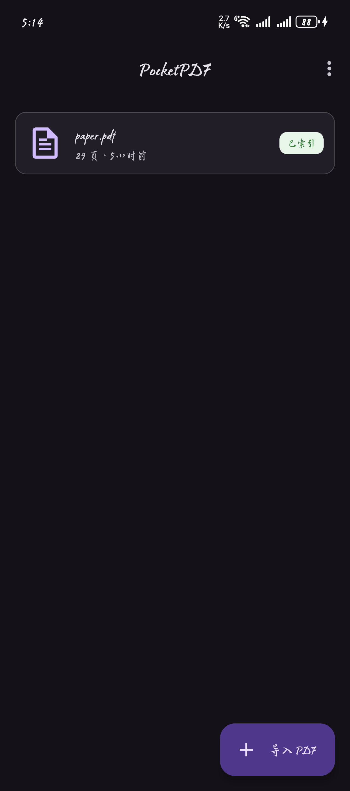
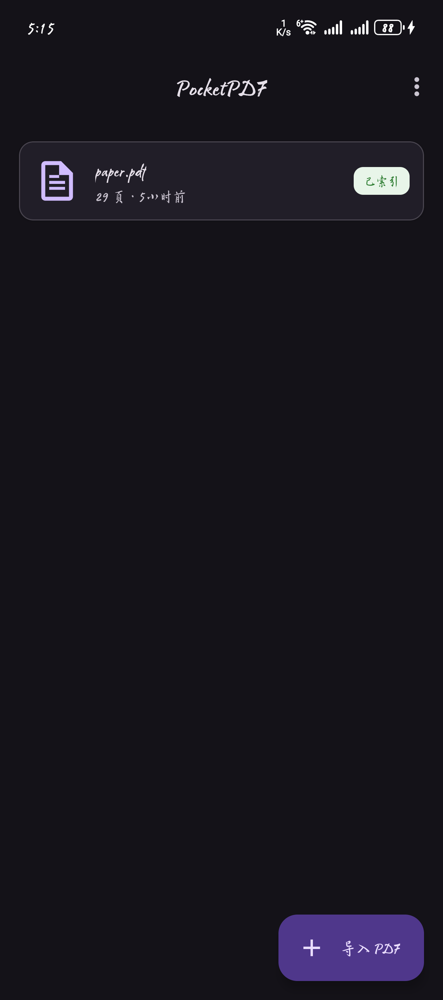
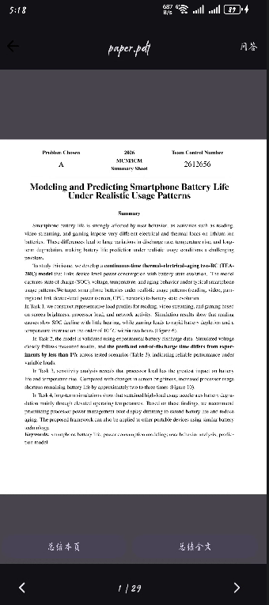
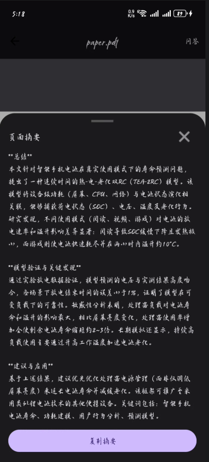
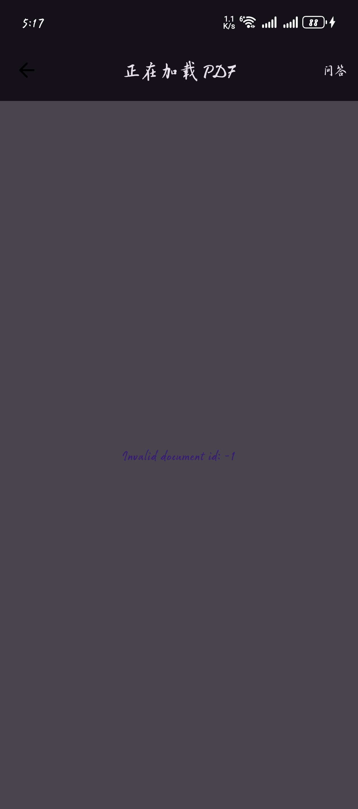
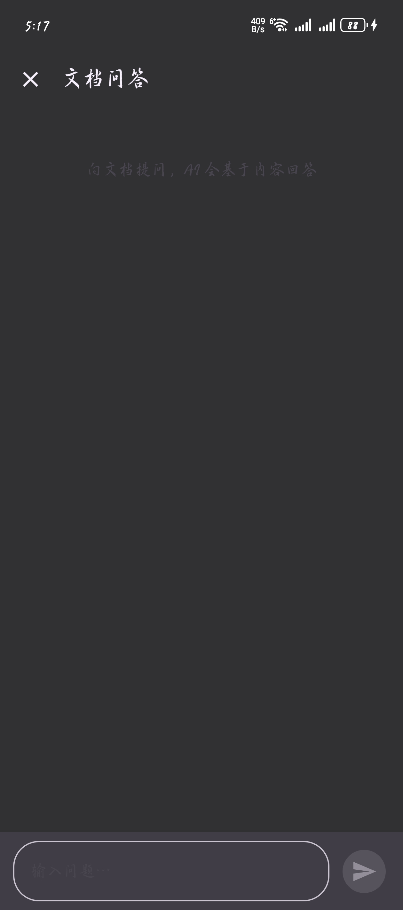
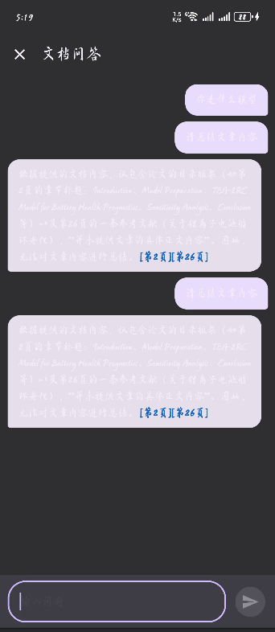
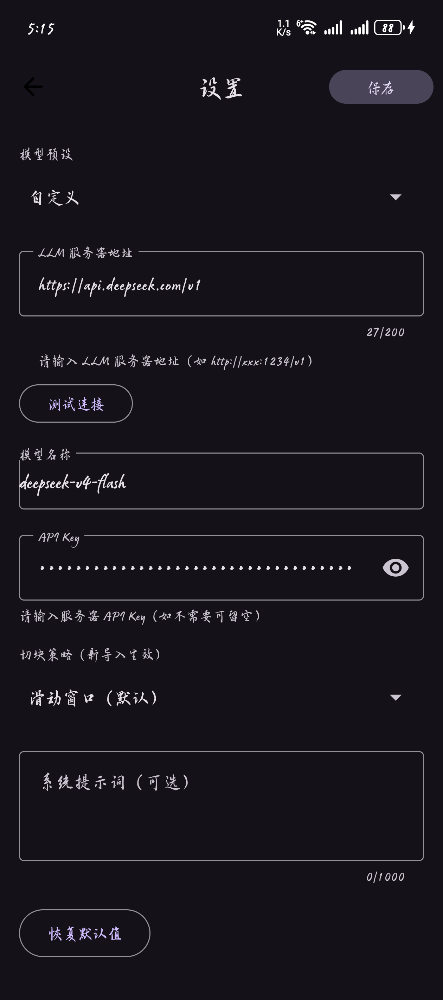
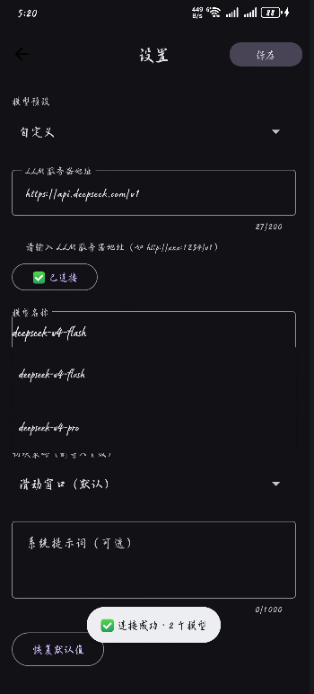

# PocketPDF · 口袋 PDF — RAG 阅读助手 for Android

> An Android PDF reader with **on-device RAG** — import PDFs, chunk & vectorize, then ask questions or generate summaries via a **local LLM** (LM Studio on your PC). Fully offline-capable after setup.

<div align="center">

[](https://github.com/stuid-maker/pocketpdf-android)
[](https://github.com/stuid-maker/pocketpdf-android)
[](https://kotlinlang.org)
[](LICENSE)
[](https://github.com/stuid-maker/pocketpdf-android/actions)
[](ROADMAP.md)
[](https://github.com/stuid-maker/pocketpdf-android/actions)
[](https://github.com/stuid-maker/pocketpdf-android/tags)

</div>

<p align="center">
  <b>English</b> · <a href="https://github.com/stuid-maker/pocketpdf-android">GitHub</a> · <a href="docs/ARCHITECTURE.md">Architecture</a> · <a href="ROADMAP.md">Roadmap</a>
</p>

---

## Features

- 📄 **Import & Read PDFs** — Browse local PDFs, render pages, bookmark your place
- 🔍 **RAG Q&A** — Ask questions about your document; get answers with page‑level citations
- 🤖 **AI Summaries** — One‑tap page‑level or full‑document summaries
- 💻 **Local LLM Support** — Connect to LM Studio (or any OpenAI‑compatible server) on your PC; no internet required after setup
- 🌙 **Dark Theme** — Material 3 with a purple accent, light & dark modes
- 🧩 **Smart Chunking** — Text is automatically chunked, embedded (MiniLM‑L6‑v2), and indexed for fast retrieval

## Architecture

PocketPDF follows **Clean Architecture** with **MVVM** in a single‑module layout:

```
┌──────────────────┐
│   ui (Compose+VM)  │  ← Activities, ViewModels, Compose screens
└────────┬─────────┘
         │ depends on
┌────────▼─────────┐
│     domain       │  ← Use Cases, Domain Models, Repository Interfaces
└────────▲─────────┘
         │ implements
┌────────┴─────────┐
│      data        │  ← Room, Retrofit (OpenAI‑compat), PdfBox, Embedder
└──────────────────┘
```

Dependency rule is strict: `ui → domain ← data`. The `domain` layer has **zero Android dependencies**.

## Tech Stack

| Layer | Choice | Badge |
|-------|--------|-------|
| Language | Kotlin 2.0 | [](https://kotlinlang.org) |
| Platform | minSdk 26 (Android 8.0+) | [](https://developer.android.com) |
| UI | Jetpack Compose (Material 3) | [](https://developer.android.com/jetpack/compose) |
| Architecture | Clean Architecture + MVVM + Repository | — |
| DI | Hilt | [](https://dagger.dev/hilt) |
| Async | Coroutines + Flow + StateFlow | [](https://kotlinlang.org/docs/coroutines-overview.html) |
| Local DB | Room | [](https://developer.android.com/training/data-storage/room) |
| Networking | Retrofit + OkHttp + okhttp-sse | [](https://square.github.io/retrofit) |
| PDF Rendering | Pdfium-Android | — |
| PDF Text | PdfBox-Android | — |
| Embedding | MediaPipe TextEmbedder (Universal Sentence Encoder) | — |
| LLM Backend | **LM Studio** (default: Gemma 3 4B-IT Q4_K_M) via OpenAI‑compatible API + `adb reverse` | — |
| Testing | JUnit4 + MockK + Turbine + Espresso | [](https://github.com/stuid-maker/pocketpdf-android) |
| CI | GitHub Actions | [](https://github.com/stuid-maker/pocketpdf-android/actions) |

## Screenshots

### 📚 Library

<div style="display: flex; flex-wrap: wrap; gap: 12px; justify-content: center;">
  
  
  
</div>

### 📖 Reader

<div style="display: flex; flex-wrap: wrap; gap: 12px; justify-content: center;">
  
  
  
</div>

### 💬 Chat / Q&A

<div style="display: flex; flex-wrap: wrap; gap: 12px; justify-content: center;">
  
  
</div>

### ⚙️ Settings

<div style="display: flex; flex-wrap: wrap; gap: 12px; justify-content: center;">
  
  
</div>

## Quick Start

### Prerequisites

- [Android Studio](https://developer.android.com/studio) (Ladybug or later)
- Android device or emulator (API 26+)
- [LM Studio](https://lmstudio.ai/) on your PC (for LLM features)
- **Embedding model** — the on-device vectorization engine needs a TFLite model file. Download it automatically via the Gradle task (recommended) or manually from Google's official storage bucket.

### Setup

```bash
# 1. Clone the repository
git clone https://github.com/stuid-maker/pocketpdf-android.git
cd pocketpdf-android

# 2. Download the embedding model (REQUIRED for AI features)
#    Download universal_sentence_encoder.tflite (~68 MB) from Google's official bucket:
#    https://storage.googleapis.com/mediapipe-models/text_embedder/universal_sentence_encoder/float32/1/universal_sentence_encoder.tflite
#    Place it at: app/src/main/assets/models/universal_sentence_encoder.tflite

# 3. Open in Android Studio
#    File → Open → select pocketpdf-android → wait for Gradle sync

# 4. Build & run
#    Select a device and press Run (▶)
```

&gt; **Why is this step needed?** The `.tflite` model file is too large to store in Git (~68 MB). Download it from Google's official MediaPipe model storage bucket. If you skip this step, PDF indexing will fail and all AI features (Q&amp;A, summaries) will be unavailable.

### LLM Backend (LM Studio)

```bash
# On your PC: Start LM Studio → Developer tab → Start Server (port 1234)
# Verify it's running:
curl http://localhost:1234/v1/models

# Bridge to your Android device:
adb reverse tcp:1234 tcp:1234

# You're all set — PocketPDF will discover models automatically.
```

## Roadmap

| Week | Theme | Status | Tag |
|------|-------|--------|-----|
| W0 | Environment setup + docs skeleton | ✅ Done | `v0.0.1-env-ready` |
| W1 | PDF reader demo | ✅ Done | `v0.1.0-pdf-reader` |
| W2 | Text chunking + vectorization + indexing | ✅ Done | `v0.2.0-indexed` |
| W3 | Retrieval + LLM bridging + summarization | ✅ Done | `v0.3.0-summary` |
| W4 | Q&A with citation backlinks + polish | 🟡 In Progress | `v0.4.0-qa` |
| W5 | Tests + docs + demo video | ⚪ Pending | `v1.0.0-release` |

## Documentation

- [`ARCHITECTURE.md`](docs/ARCHITECTURE.md) — Detailed architectural decisions
- [`PLAN.md`](PLAN.md) — Project plan & technical choices
- [`ROADMAP.md`](ROADMAP.md) — Week‑by‑week task list
- [`CONTRIBUTING.md`](CONTRIBUTING.md) — Coding conventions & Git workflow
- [`dev-log/`](docs/dev-log/) — Weekly development logs

## License

[MIT](LICENSE) © stuid-maker
