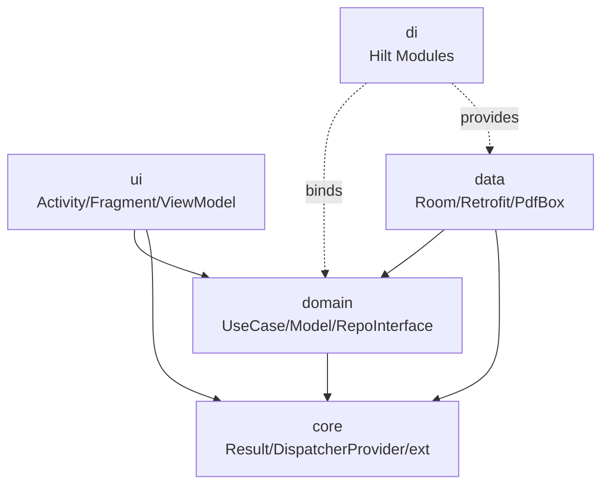

# PocketPDF · 架构说明

> 本文随项目演进同步更新。W0 仅占位；W5 完整版。

最近更新：Week 0 · 2026-05-11

---

## 1. 概览

PocketPDF 采用 **Clean Architecture 思想 + 单 Module 分层** 的方式实现。设计核心目标：

1. **领域逻辑可测试**：`domain` 层是纯 Kotlin，不依赖任何 Android API
2. **依赖方向单一**：`ui → domain ← data`
3. **可替换性**：LLM 后端在 LM Studio / Ollama / 云端 OpenAI 兼容 API（DeepSeek、通义、Together AI…）之间切换不影响 `domain` 和 `ui`
4. **新手友好**：单 Gradle Module，避免多模块 Gradle 配置陷阱

## 2. 模块边界



## 3. 数据流（单向）

```
View ── intent ──▶ ViewModel ── invoke ──▶ UseCase ── call ──▶ Repository
View ◀── state ── ViewModel ◀── result ── UseCase ◀── data ── Repository
```

- ViewModel 持有 `StateFlow<UiState>`
- View 用 `repeatOnLifecycle(STARTED)` 收集
- UseCase 返回 `Flow<Result<T>>` 或 `suspend fun`
- 错误统一 `Result<T>` 封装

## 4. 关键子系统（W1–W4 填充）

### 4.1 PDF 解析与渲染（W1）

待补。

### 4.2 切块与向量化（W2）

待补。

### 4.3 检索与 LLM 调用（W3）

待补。

### 4.4 RAG 问答（W4）

待补。

## 5. 关键决策记录（ADR）

每个重要的技术决策记录在此，参考 [Architecture Decision Records](https://adr.github.io/)。

### ADR-001: 用 XML 而非 Compose

- **背景**：开发者是 Android 新手，5 周硬 DDL
- **决策**：用 XML + ViewBinding + Material Components
- **理由**：XML 资料和 AI 训练数据更充足，新手 + AI 辅助路径更稳；Compose 状态管理对新手是额外认知负担
- **代价**：与 2026 主流（Compose）有距离，面试时要解释清楚选择理由
- **日期**：2026-05-11

### ADR-002: 用「PC 端 LLM 服务 + OpenAI 兼容协议」桥接，而非端侧推理

- **背景**：5 周内无法稳定集成 LiteRT-LM 端侧推理；开发机已装 LM Studio，模型现成
- **候选**：
  - A. 端侧推理（LiteRT-LM + Gemma 3n）：开发周期长、设备适配复杂
  - B. PC 端 **Ollama** + Ollama 私有协议（原计划）
  - C. PC 端 **LM Studio** + **OpenAI 兼容协议**（最终选）
  - D. 直接对接云端 OpenAI / DeepSeek API
- **决策**：开发期采用 **C**；契约层固定为 OpenAI Chat Completions 协议；端侧推理列为 v2；云端 API 因协议同构，未来可零改动切换
- **理由**：
  1. **零下载成本**：LM Studio 已装，Gemma 3 4B-IT Q4_K_M / Gemma 3n E4B-IT Q8_0 已下载
  2. **协议通用**：OpenAI Chat Completions 是事实标准，DeepSeek / 通义 / Together AI / vLLM 全兼容；Ollama 私有协议只服务 Ollama
  3. **未来扩展便宜**：从 LM Studio 切到云端 DeepSeek 只需改 `BASE_URL` 和 API Key
  4. **简历叙事更通用**：写"对接 OpenAI 兼容 LLM 服务"比"对接 Ollama"通用性更强
- **代价**：演示需要 PC 在线；LM Studio Server 需要手动在 GUI 里点 Start（或 `lms server start`，可写脚本）；不能脱机使用
- **端口**：`localhost:1234`（adb reverse `tcp:1234 tcp:1234`）
- **日期**：2026-05-11（初稿）/ 2026-05-11（修订：Ollama → LM Studio + OpenAI 兼容）

### ADR-003: 单 Module 而非多 Module

- **背景**：Clean Architecture 通常多模块化
- **决策**：单 `app` module + 严格分包
- **理由**：避免新手在多模块 Gradle 配置上浪费 1–2 天；分包 + 包路径规则也能保证依赖方向
- **代价**：编译时无法强制依赖方向（靠人工 review + 包路径规则）
- **日期**：2026-05-11

## 6. 性能预算

| 操作 | 目标 | 备注 |
|---|---|---|
| 冷启动 | < 2s | minSdk 26 中端机 |
| 100 页 PDF 文本提取 | < 5s | PdfBox-Android |
| 100 页 PDF 索引（embed） | < 30s | 后台 WorkManager |
| 检索 Top-5 | < 200ms | 内存余弦相似度 |
| LLM 首 token | < 3s | LM Studio + Gemma 3 4B-IT Q4_K_M |
| 流式 token 速度 | > 15 tokens/s | PC 端 |

## 7. 安全与隐私

- 文档复制到 App 内部存储（`filesDir`），其他应用无法访问
- 文档不上云
- LLM 调用走 `adb reverse` 到 localhost:1234（LM Studio），**数据不出 PC**
- 不收集任何遥测数据
