# PocketPDF · 架构说明

> 本文随项目演进同步更新。当前版本包含统一 PDFium 阅读、搜索与索引链路。

最近更新：2026-06-09

---

## 1. 概览

PocketPDF 采用 **Clean Architecture 思想 + 单 Module 分层** 的方式实现。设计核心目标：

1. **领域逻辑可测试**：`domain` 层是纯 Kotlin，不依赖任何 Android API
2. **依赖方向单一**：`ui → domain ← data`
3. **可替换性**：LLM 后端在 LM Studio / Ollama / 云端 OpenAI 兼容 API（DeepSeek、通义、Together AI…）之间切换不影响 `domain` 和 `ui`
4. **新手友好**：单 Gradle Module，避免多模块 Gradle 配置陷阱

### 技术栈总览

| 层级 | 选择 | 说明 |
|------|------|------|
| 语言 | Kotlin 2.0.21 | 配合 KSP 2.0.21-1.0.28 |
| 最低 API | 26 (Android 8.0) | 覆盖 95%+ 设备 |
| UI 主体 | XML + Material Components + ViewBinding | 阅读器、文档库 |
| UI Chat | Jetpack Compose + Material 3 | 问答界面（W4 引入） |
| DI | Hilt 2.52 | @HiltAndroidApp + @HiltViewModel |
| 数据库 | Room 2.7 | AutoMigration v1→v2→v3 |
| 网络 | OkHttp 4.12（原生，无 Retrofit） | SSE 流式、模型列表、连接测试统一走 OkHttp |
| PDF 阅读/搜索/文本 | PdfiumAndroid 1.0.30 + 自定义 PdfPageView | 同一引擎负责渲染、文本和搜索坐标 |
| PDF 兼容路径 | PdfBox-Android 2.0.27 | 仅保留旧的长按标注字符位置能力 |
| 向量化 | MediaPipe TextEmbedder (on-device) | MiniLM-L6-v2 / USE .tflite |
| LLM 后端 | LM Studio (Gemma 3 4B-IT) | OpenAI 兼容协议，adb reverse 桥接 |
| 后台任务 | WorkManager | 文档索引用 OneTimeWorkRequest |
| 测试 | JUnit4 + MockK + Turbine + Robolectric | domain 层 70%+ 覆盖率 |

---

## 2. 模块边界

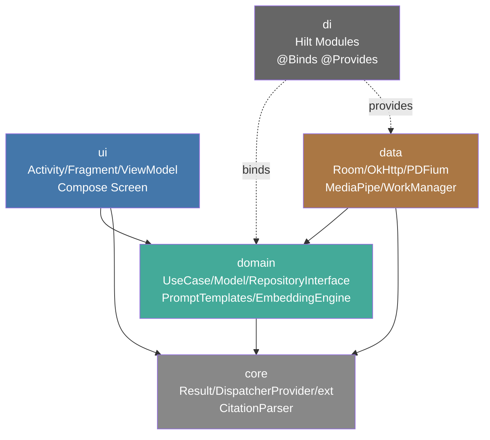
```mermaid
graph TD
    UI[ui<br/>Activity/Fragment/ViewModel<br/>Compose Screen] --> DOMAIN
    DI[di<br/>Hilt Modules<br/>@Binds @Provides] -.binds.-> DOMAIN
    DI -.provides.-> DATA
    DATA[data<br/>Room/OkHttp/PDFium<br/>MediaPipe/WorkManager] --> DOMAIN
    DOMAIN[domain<br/>UseCase/Model/RepositoryInterface<br/>PromptTemplates/EmbeddingEngine]
    UI --> CORE
    DATA --> CORE
    DOMAIN --> CORE
    CORE[core<br/>Result/DispatcherProvider/ext<br/>CitationParser]
    
    style DOMAIN fill:#4a9,color:#fff
    style UI fill:#47a,color:#fff
    style DATA fill:#a74,color:#fff
    style DI fill:#666,color:#fff
    style CORE fill:#888,color:#fff
```

### 包依赖规则

- `domain` → 零 Android 依赖（纯 Kotlin）
- `ui` → 依赖 `domain` + `core`
- `data` → 依赖 `domain` + `core`
- `di` → 依赖 `domain` + `data`（提供 Hilt 绑定）
- `core` → 无工程内依赖（工具类 + 扩展）

---

## 3. 数据流（单向）

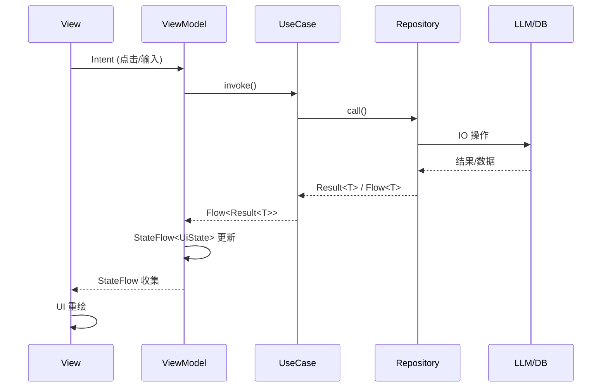
```mermaid
sequenceDiagram
    participant View
    participant ViewModel
    participant UseCase
    participant Repository
    participant LLM/DB

    View->>ViewModel: Intent (点击/输入)
    ViewModel->>UseCase: invoke()
    UseCase->>Repository: call()
    Repository->>LLM/DB: IO 操作
    LLM/DB-->>Repository: 结果/数据
    Repository-->>UseCase: Result<T> / Flow<T>
    UseCase-->>ViewModel: Flow<Result<T>>
    ViewModel->>ViewModel: StateFlow<UiState> 更新
    ViewModel-->>View: StateFlow 收集
    View->>View: UI 重绘
```

- ViewModel 持有 `StateFlow<UiState>`
- View 用 `repeatOnLifecycle(STARTED)` 收集
- UseCase 返回 `Flow<Result<T>>` 或 `suspend fun`
- 错误统一 `Result<T>` 封装（自定义 sealed class 而非 kotlin.Result）

---

## 4. 关键子系统

### 4.1 PDF 解析与渲染（W1）

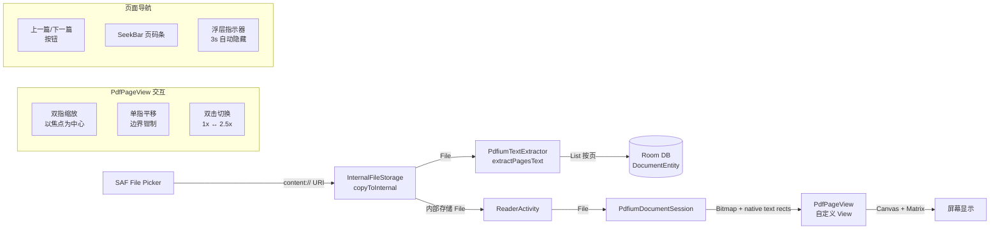
```mermaid
graph LR
    SAF[SAF File Picker] -->|content:// URI| Copy[InternalFileStorage<br/>copyToInternal]
    Copy -->|File| Parse[PdfiumTextExtractor<br/>extractPagesText]
    Parse -->|List<String> 按页| Room[(Room DB<br/>DocumentEntity)]
    Copy -->|内部存储 File| Render[ReaderActivity]
    
    Render -->|File| Session[PdfiumDocumentSession]
    Session -->|Bitmap + native text rects| PdfPageView[PdfPageView<br/>自定义 View]
    PdfPageView -->|Canvas + Matrix| Display[屏幕显示]
    
    subgraph PdfPageView 交互
        PinchZoom[双指缩放<br/>以焦点为中心]
        Pan[单指平移<br/>边界钳制]
        DoubleTap[双击切换<br/>1x ↔ 2.5x]
    end
    
    subgraph 页面导航
        PrevNext[上一篇/下一篇<br/>按钮]
        SeekBar[SeekBar 页码条]
        PageIndicator[浮层指示器<br/>3s 自动隐藏]
    end
```

#### 统一 PDFium 流程

```
file → PdfDocumentEngine.open() → PdfiumDocumentSession
     → renderPage() / extractText() / searchPage()
```

- 阅读器渲染、关键词匹配、命中矩形和 AI 索引文本来自同一个 PDFium 会话抽象。
- 原生坐标通过 PDFium `mapPageCoordsToDevice` 映射，覆盖页面旋转、Y 轴方向和 CropBox。
- 提取器版本写入文档记录；版本变化会自动重建索引。
- 无文本层的扫描 PDF 标记为 `NEEDS_OCR`，当前版本不把 OCR 结果伪装成可检索文本。
- PDFBox 只用于旧的长按标注字符位置路径，不参与阅读器搜索、命中高亮或 AI 索引。

#### PdfPageView 自定义渲染

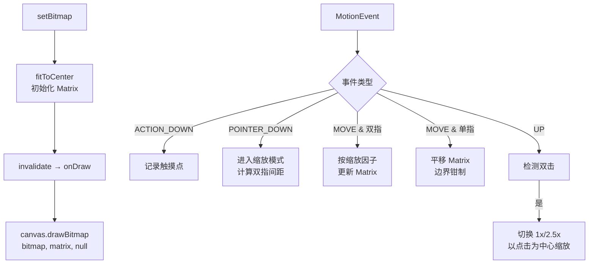
```mermaid
flowchart TD
    A[setBitmap] --> B[fitToCenter<br/>初始化 Matrix]
    B --> C[invalidate → onDraw]
    C --> D[canvas.drawBitmap<br/>bitmap, matrix, null]
    E[MotionEvent] --> F{事件类型}
    F -->|ACTION_DOWN| G[记录触摸点]
    F -->|POINTER_DOWN| H[进入缩放模式<br/>计算双指间距]
    F -->|MOVE & 双指| I[按缩放因子<br/>更新 Matrix]
    F -->|MOVE & 单指| J[平移 Matrix<br/>边界钳制]
    F -->|UP| K[检测双击]
    K -->|是| L[切换 1x/2.5x<br/>以点击为中心缩放]
```

- `Matrix` 为核心：setScale + postTranslate
- 缩放以双指焦点为中心，通过 `(焦点 - 原Bitmap坐标 × 新scale)` 计算新平移
- 缩放范围 0.5x ~ 5x
- 双击检测：300ms 内 + 50px 偏移容差

#### 页面导航与浮层

- 点击 PDF 表面显示页码指示器浮层（`SeekBar` + `TextView`），3 秒自动隐藏
- 底部 `上一页` / `下一页` 按钮
- 封面使用 `Int` 字面量而非 ContextCompat 字符串避免 HiddenApi 限制

---

### 4.2 切块与向量化（W2）

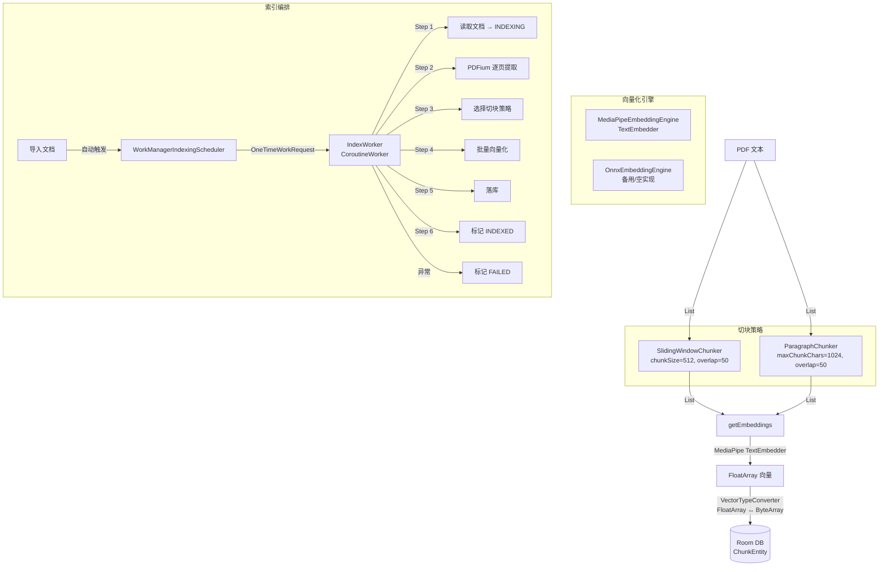
```mermaid
graph TD
    subgraph 切块策略
        SW[SlidingWindowChunker<br/>chunkSize=512, overlap=50]
        PC[ParagraphChunker<br/>maxChunkChars=1024, overlap=50]
    end
    
    subgraph 向量化引擎
        MP[MediaPipeEmbeddingEngine<br/>TextEmbedder]
        ONNX[OnnxEmbeddingEngine<br/>备用/空实现]
    end
    
    PDF[PDF 文本] -->|List<String>| SW
    PDF -->|List<String>| PC
    SW -->|List<DocumentChunk>| Embed[getEmbeddings]
    PC -->|List<DocumentChunk>| Embed
    Embed -->|MediaPipe TextEmbedder| Vec[FloatArray 向量]
    Vec -->|VectorTypeConverter<br/>FloatArray ↔ ByteArray| Room[(Room DB<br/>ChunkEntity)]
    
    subgraph 索引编排
        Import[导入文档] -->|自动触发| Scheduler[WorkManagerIndexingScheduler]
        Scheduler -->|OneTimeWorkRequest| IW[IndexWorker<br/>CoroutineWorker]
        IW -->|Step 1| ReadDoc[读取文档 → INDEXING]
        IW -->|Step 2| ExtractText[PDFium 逐页提取]
        IW -->|Step 3| ChooseChunker[选择切块策略]
        IW -->|Step 4| BatchEmbed[批量向量化]
        IW -->|Step 5| SaveChunks[落库]
        IW -->|Step 6| MarkIndexed[标记 INDEXED]
        IW -->|异常| MarkFailed[标记 FAILED]
    end
```

#### TextChunker 接口

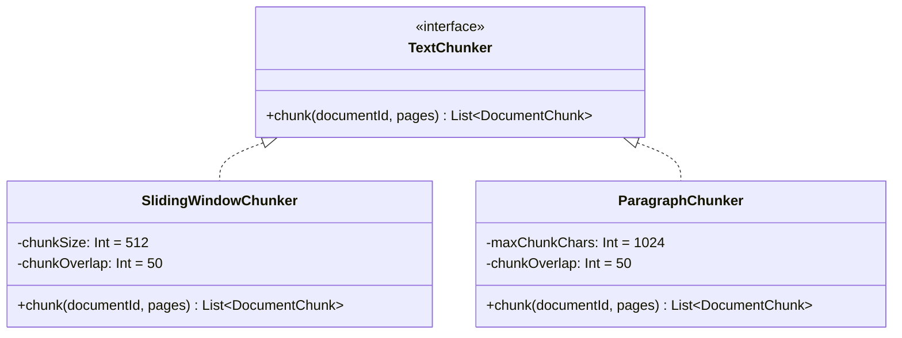
```mermaid
classDiagram
    class TextChunker {
        <<interface>>
        +chunk(documentId, pages) List~DocumentChunk~
    }
    class SlidingWindowChunker {
        -chunkSize: Int = 512
        -chunkOverlap: Int = 50
        +chunk(documentId, pages) List~DocumentChunk~
    }
    class ParagraphChunker {
        -maxChunkChars: Int = 1024
        -chunkOverlap: Int = 50
        +chunk(documentId, pages) List~DocumentChunk~
    }
    TextChunker <|.. SlidingWindowChunker
    TextChunker <|.. ParagraphChunker
```

- **SlidingWindowChunker**（默认）：滑动窗口切分，按页独立处理，中文也适用。
  - 步骤：清理空白 → 超长则滑动窗口（chunkSize=512, overlap=50）→ 短页直接作为一个 chunk
- **ParagraphChunker**：按段落边界（`\n\n`）切分。
  - 段落过长时内部用滑动窗口二次切分
  - 适合论文、报告等结构清晰的文档
- 策略通过 `SettingsDataStore.chunkingStrategy` 设置，`IndexWorker` 中根据配置选择

#### EmbeddingEngine 接口

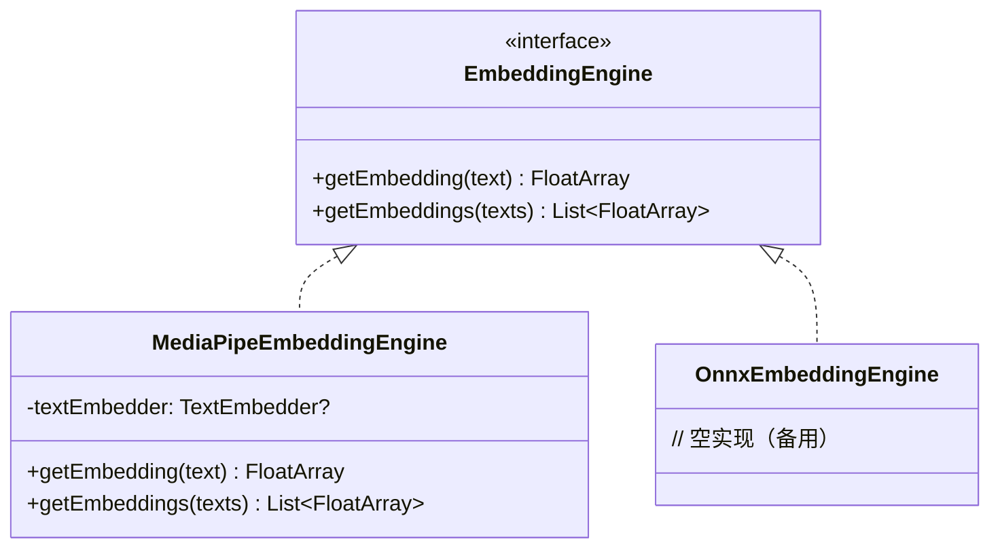
```mermaid
classDiagram
    class EmbeddingEngine {
        <<interface>>
        +getEmbedding(text) FloatArray
        +getEmbeddings(texts) List~FloatArray~
    }
    class MediaPipeEmbeddingEngine {
        -textEmbedder: TextEmbedder?
        +getEmbedding(text) FloatArray
        +getEmbeddings(texts) List~FloatArray~
    }
    class OnnxEmbeddingEngine {
        // 空实现（备用）
    }
    EmbeddingEngine <|.. MediaPipeEmbeddingEngine
    EmbeddingEngine <|.. OnnxEmbeddingEngine
```

- **MediaPipeEmbeddingEngine**：使用 Google MediaPipe TextEmbedder
  - 模型路径：`assets/models/universal_sentence_encoder.tflite`
  - 懒加载 + 双重检查锁定的单例初始化
  - 批量 embedding 在主线程返回，内部通过 `Dispatchers.Default` 执行
- **OnnxEmbeddingEngine**：空实现，预留作为备用方案

#### IndexWorker 状态机

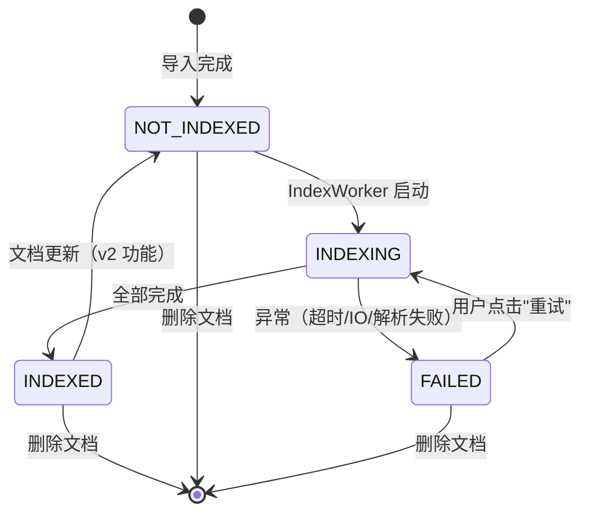
```mermaid
stateDiagram-v2
    [*] --> NOT_INDEXED: 导入完成
    NOT_INDEXED --> INDEXING: IndexWorker 启动
    INDEXING --> INDEXED: 全部完成
    INDEXING --> FAILED: 异常（超时/IO/解析失败）
    FAILED --> INDEXING: 用户点击"重试"
    INDEXED --> NOT_INDEXED: 文档更新（v2 功能）
    INDEXED --> [*]: 删除文档
    NOT_INDEXED --> [*]: 删除文档
    FAILED --> [*]: 删除文档
```

- `IndexWorker` 是 `@HiltWorker`（CoroutineWorker）
- 接收 `documentId` 参数
- 6 步流程：读取文档 → 提取 PDF 文本 → 切片 → 批量向量化 → 回填并落库 → 标记 INDEXED
- 异常处理：标记 FAILED，UI 显示重试按钮
- 空文档（纯扫描件）：直接标记 INDEXED 不产生 chunks

#### Room 数据库 Schema

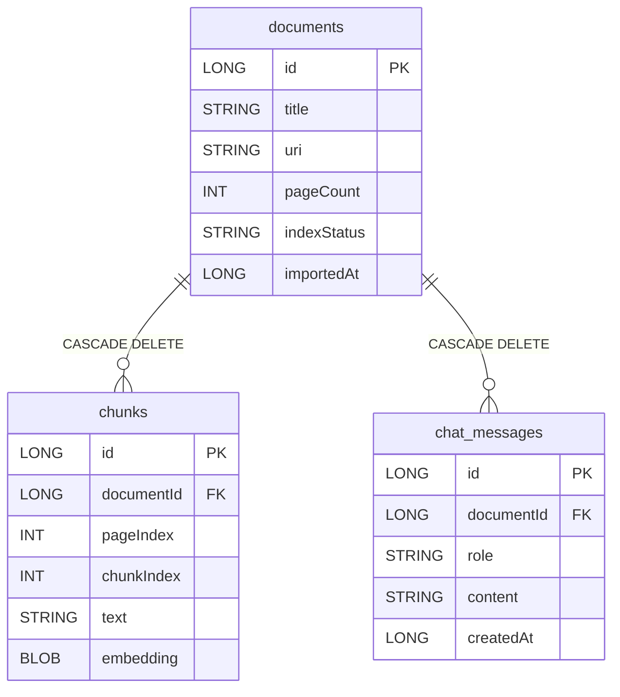
```mermaid
erDiagram
    documents ||--o{ chunks : "CASCADE DELETE"
    documents ||--o{ chat_messages : "CASCADE DELETE"
    
    documents {
        LONG id PK
        STRING title
        STRING uri
        INT pageCount
        STRING indexStatus
        LONG importedAt
    }
    
    chunks {
        LONG id PK
        LONG documentId FK
        INT pageIndex
        INT chunkIndex
        STRING text
        BLOB embedding
    }
    
    chat_messages {
        LONG id PK
        LONG documentId FK
        STRING role
        STRING content
        LONG createdAt
    }
```

- `IndexStatus` 存为 String（枚举 `name`）而非序数——避免枚举变更导致数据错位
- `embedding` 用 `FloatArray` 通过 `VectorTypeConverter` 转 `ByteArray`（BLOB）
  - Little-Endian 编码，每个 float 4 字节
- 外键级联删除：文档删除时自动清理 chunks + 聊天消息
- 索引：`documents.importedAt`、`chunks.documentId`、`chat_messages.documentId`

---

### 4.3 检索与 LLM 调用（W3）

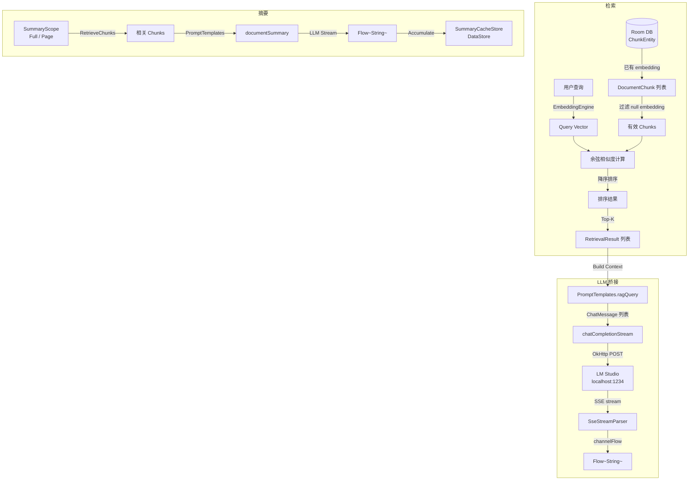
```mermaid
graph TD
    subgraph 检索
        Query[用户查询] -->|EmbeddingEngine| QVec[Query Vector]
        Room[(Room DB<br/>ChunkEntity)] -->|已有 embedding| Chunks[DocumentChunk 列表]
        Chunks -->|过滤 null embedding| Filtered[有效 Chunks]
        QVec --> CS[余弦相似度计算]
        Filtered --> CS
        CS -->|降序排序| Sorted[排序结果]
        Sorted -->|Top-K| TopK[RetrievalResult 列表]
    end
    
    subgraph LLM 桥接
        TopK -->|Build Context| Prompt[PromptTemplates.ragQuery]
        Prompt -->|ChatMessage 列表| Stream[chatCompletionStream]
        Stream -->|OkHttp POST| LMStudio[LM Studio<br/>localhost:1234]
        LMStudio -->|SSE stream| Parser[SseStreamParser]
        Parser -->|channelFlow| Flow[Flow~String~]
    end
    
    subgraph 摘要
        Scope[SummaryScope<br/>Full / Page] -->|RetrieveChunks| TopK2[相关 Chunks]
        TopK2 -->|PromptTemplates| SummaryPrompt[documentSummary]
        SummaryPrompt -->|LLM Stream| SummaryFlow[Flow~String~]
        SummaryFlow -->|Accumulate| Cache[SummaryCacheStore<br/>DataStore]
    end
```

#### RetrieveChunksUseCase

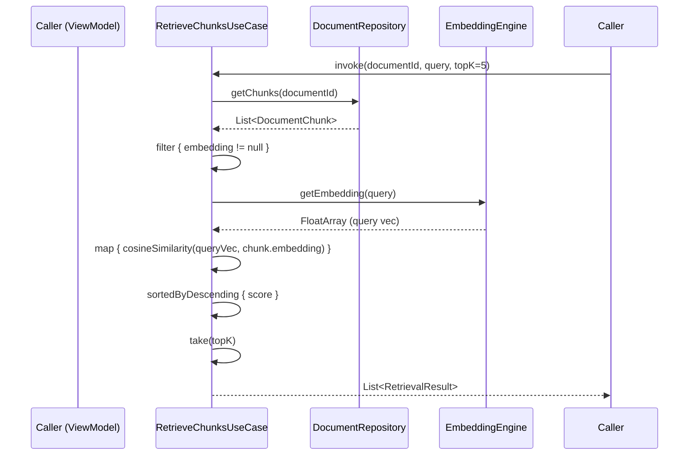
```mermaid
sequenceDiagram
    participant Caller (ViewModel)
    participant RCU as RetrieveChunksUseCase
    participant Repo as DocumentRepository
    participant EE as EmbeddingEngine
    
    Caller->>RCU: invoke(documentId, query, topK=5)
    RCU->>Repo: getChunks(documentId)
    Repo-->>RCU: List<DocumentChunk>
    RCU->>RCU: filter { embedding != null }
    RCU->>EE: getEmbedding(query)
    EE-->>RCU: FloatArray (query vec)
    RCU->>RCU: map { cosineSimilarity(queryVec, chunk.embedding) }
    RCU->>RCU: sortedByDescending { score }
    RCU->>RCU: take(topK)
    RCU-->>Caller: List<RetrievalResult>
```

- 余弦相似度算法：`cos(θ) = dot(a, b) / (|a| × |b|)`
- 防御性检查：
  - 维度不一致 → `IllegalStateException`
  - 零向量 → 返回 0
  - NaN 结果 → 返回 0

#### LlmRepository

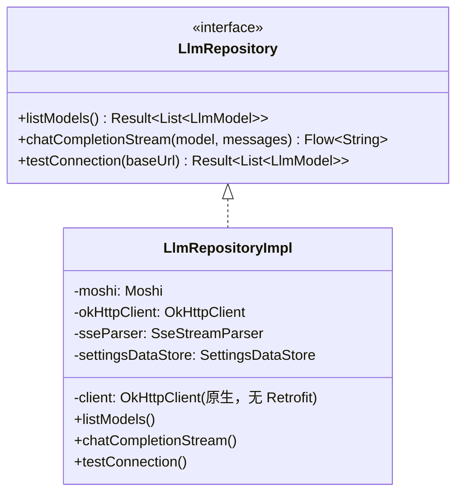
```mermaid
classDiagram
    class LlmRepository {
        <<interface>>
        +listModels() Result~List~LlmModel~~
        +chatCompletionStream(model, messages) Flow~String~
        +testConnection(baseUrl) Result~List~LlmModel~~
    }
    class LlmRepositoryImpl {
        -client: OkHttpClient (原生，无 Retrofit)
        -moshi: Moshi
        -okHttpClient: OkHttpClient
        -sseParser: SseStreamParser
        -settingsDataStore: SettingsDataStore
        +listModels()
        +chatCompletionStream()
        +testConnection()
    }
    LlmRepository <|.. LlmRepositoryImpl
```

- 非流式调用（listModels）走 Retrofit
- 流式调用（chatCompletionStream）走原生 OkHttp：
  - Retrofit 的 suspend 会把整个 response body 读进内存，不适用于 SSE 大流式响应
  - 原生 OkHttp 直接拿到 `ResponseBody.source()`，逐行读取
- DTO 映射：`ModelDto.toDomain()`，Domain 层对后端差异无感知

#### SseStreamParser

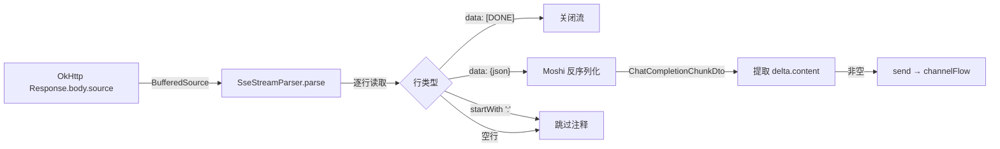
```mermaid
flowchart LR
    A[OkHttp Response.body.source] -->|BufferedSource| B[SseStreamParser.parse]
    B -->|逐行读取| C{行类型}
    C -->|"data: [DONE]"| D[关闭流]
    C -->|"data: {json}"| E[Moshi 反序列化]
    E -->|ChatCompletionChunkDto| F[提取 delta.content]
    F -->|非空| G[send → channelFlow]
    C -->|"startWith ':'"| H[跳过注释]
    C -->|空行| H
```

- 基于 `channelFlow` + `Dispatchers.IO` 逐行读取
- 协议格式：OpenAI SSE `data: {json}\n\n`
- 支持 `data: [DONE]` 流结束标记
- JSON 解析失败仅打警告日志，不中断流

#### 摘要子系统

```mermaid
graph TD
    subgraph SummarizeDocumentUseCase
        A[检查缓存] -->|有缓存| B[emit 缓存]
        A -->|无缓存| C{Scope 类型}
        C -->|Full| D[retrieveChunks<br/>query="全文核心内容"]
        C -->|Page| E[getChunksByPage<br/>指定页]
        D --> F[构建 prompt]
        E --> F
        F --> G[LLM 流式生成]
        G -->|accumulate| H[写入 SummaryCacheStore]
        G -->|逐 token| I[emit → Flow]
    end
    
    subgraph PromptTemplates
        J[ragQuery<br/>RAG 问答]
        K[documentSummary<br/>全文摘要]
        L[chunkSummary<br/>Map 阶段]
        M[mergeSummaries<br/>Reduce 阶段]
    end
    
    subgraph SummaryCacheStore
        N[DataStore<br/>"summary_cache"]
        O[key = "summary:{docId}:{scope}"]
        P[get / set / invalidate]
    end
```

- **SummarizeDocumentUseCase**
  - 先查 `SummaryCacheStore`（DataStore 实现），缓存命中直接返回
  - 缓存未命中：检索 chunks → 构建 prompt → LLM 流式生成 → 累加写入缓存
  - `Full` 范围：`retrieveChunks(documentId, "全文核心内容", topK=5)` 取关键 chunks
  - `Page` 范围：`getChunksByPage(documentId, pageIndex)` 取指定页全部 chunks
  - 无 chunks 时抛 `NoChunksException` / `NoChunksForPageException`

- **PromptTemplates**
  - `ragQuery(context, question)`：RAG 问答 prompt，要求 LLM 回答时标注 `[第N页]`
  - `documentSummary(chunks)`：全文摘要 prompt
  - `chunkSummary(chunkText)`：MapReduce Map 阶段
  - `mergeSummaries(summaries)`：MapReduce Reduce 阶段
  - 所有模板强制中文输出

- **SummaryCacheStore**
  - 基于 `preferencesDataStore(name = "summary_cache")`
  - Key 格式：`summary:{documentId}:{scope}`（scope = "full" 或 "page_{index}"）
  - `invalidate(documentId)`：文档重索引时清除所有缓存

---

### 4.4 RAG 问答（W4）

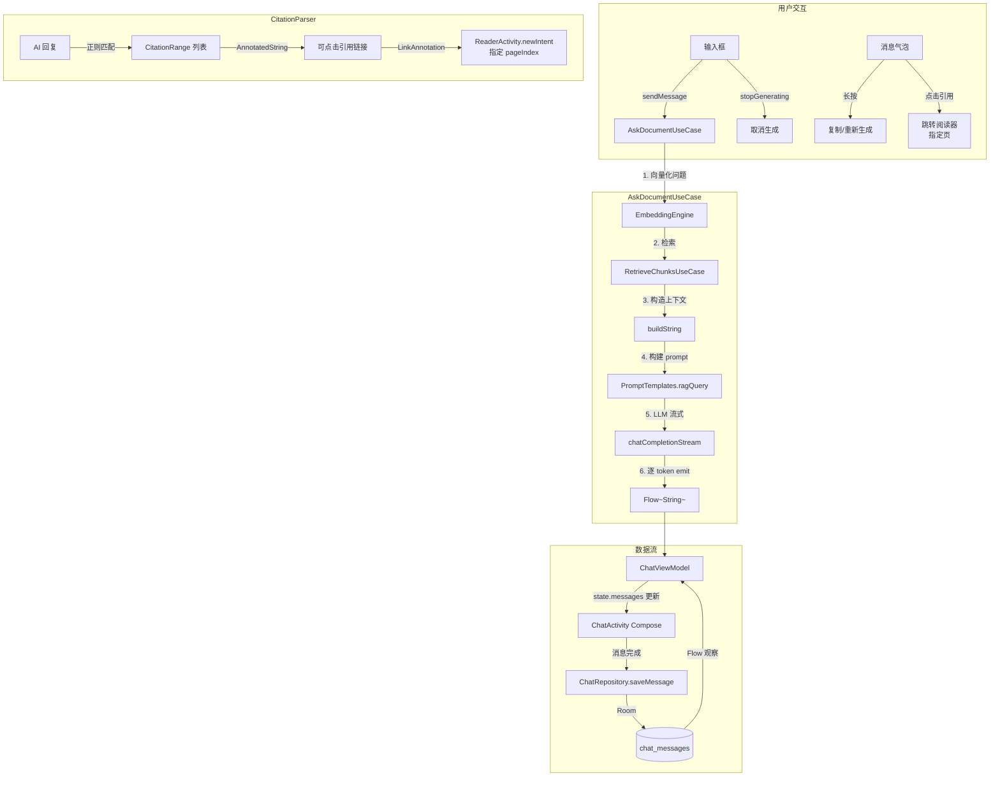
```mermaid
graph TD
    subgraph 用户交互
        Input[输入框] -->|sendMessage| Ask[AskDocumentUseCase]
        Input -->|stopGenerating| Cancel[取消生成]
        Bubble[消息气泡] -->|长按| Menu[复制/重新生成]
        Bubble -->|点击引用| Reader[跳转阅读器<br/>指定页]
    end
    
    subgraph AskDocumentUseCase
        Ask -->|1. 向量化问题| Embed[EmbeddingEngine]
        Embed -->|2. 检索| Retrieve[RetrieveChunksUseCase]
        Retrieve -->|3. 构造上下文| Context[buildString]
        Context -->|4. 构建 prompt| Prompt[PromptTemplates.ragQuery]
        Prompt -->|5. LLM 流式| Stream[chatCompletionStream]
        Stream -->|6. 逐 token emit| Tokens[Flow~String~]
    end
    
    subgraph 数据流
        Tokens --> ChatVM[ChatViewModel]
        ChatVM -->|state.messages 更新| UI[ChatActivity Compose]
        UI -->|消息完成| Save[ChatRepository.saveMessage]
        Save -->|Room| ChatDB[(chat_messages)]
        ChatDB -->|Flow 观察| ChatVM
    end
    
    subgraph CitationParser
        AI[AI 回复] -->|正则匹配| Ranges[CitationRange 列表]
        Ranges -->|AnnotatedString| Clickable[可点击引用链接]
        Clickable -->|LinkAnnotation| Jump[ReaderActivity.newIntent<br/>指定 pageIndex]
    end
```

#### AskDocumentUseCase 完整流程

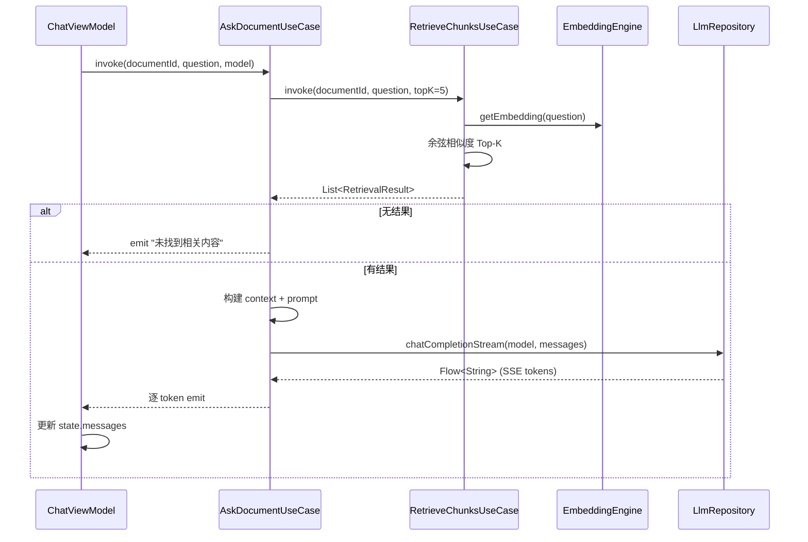
```mermaid
sequenceDiagram
    participant VM as ChatViewModel
    participant AD as AskDocumentUseCase
    participant RC as RetrieveChunksUseCase
    participant EE as EmbeddingEngine
    participant LLM as LlmRepository
    
    VM->>AD: invoke(documentId, question, model)
    AD->>RC: invoke(documentId, question, topK=5)
    RC->>EE: getEmbedding(question)
    RC->>RC: 余弦相似度 Top-K
    RC-->>AD: List<RetrievalResult>
    
    alt 无结果
        AD-->>VM: emit "未找到相关内容"
    else 有结果
        AD->>AD: 构建 context + prompt
        AD->>LLM: chatCompletionStream(model, messages)
        LLM-->>AD: Flow<String> (SSE tokens)
        AD-->>VM: 逐 token emit
        VM->>VM: 更新 state.messages
    end
```

#### ChatViewModel 状态管理

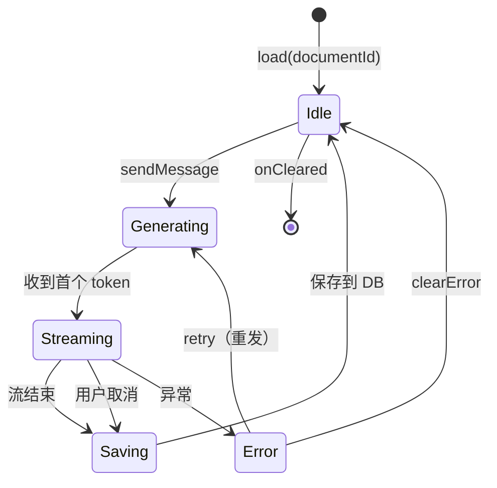
```mermaid
stateDiagram-v2
    [*] --> Idle: load(documentId)
    Idle --> Generating: sendMessage
    Generating --> Streaming: 收到首个 token
    Streaming --> Saving: 流结束
    Streaming --> Saving: 用户取消
    Streaming --> Error: 异常
    Saving --> Idle: 保存到 DB
    Error --> Idle: clearError
    Error --> Generating: retry（重发）
    Idle --> [*]: onCleared
```

- `localMessageCounter`：本地临时消息 ID 从 `1_000_000_000` 开始，避免与 DB 自增 ID 冲突
- `historyJob`：通过 `chatRepository.observeMessages(documentId)` 收集 Room Flow
  - 合并策略：保留本地-only 消息（未持久化的流式占位符）+ DB 消息去重

#### 引用解析与回溯

```mermaid
flowchart LR
    A[AI 回复文本] -->|CitationParser.parseWithRanges| B[CitationRange 列表]
    B --> C{buildAnnotatedString}
    C --> D["[第3页]" → LinkAnnotation.Clickable]
    D --> E[tag = "page_2"]
    E --> F[点击 → ReaderActivity<br/>newIntent(documentId, pageIndex=2)]
    
    subgraph 支持格式
        G[来源：第N页]
        H[第N页]
        I[Page N]
        J[(P.N)]
        K[【来源N】]
    end
```

- **CitationParser**：5 种正则匹配模式，覆盖 LLM 可能的输出格式
  - `[来源：第3页]`、`[第3页]`、`[Page 3]`、`(P.3)`、`【来源3】`
- `parseWithRanges` 返回 `CitationRange`（start, end, pageIndex, displayText）
- Compose UI：`buildAnnotatedString` + `pushLink(LinkAnnotation.Clickable)` 渲染可点击引用
- 点击触发 `ReaderActivity.newIntent(context, documentId, pageIndex)` 跳转到指定页

#### Chat UI 架构

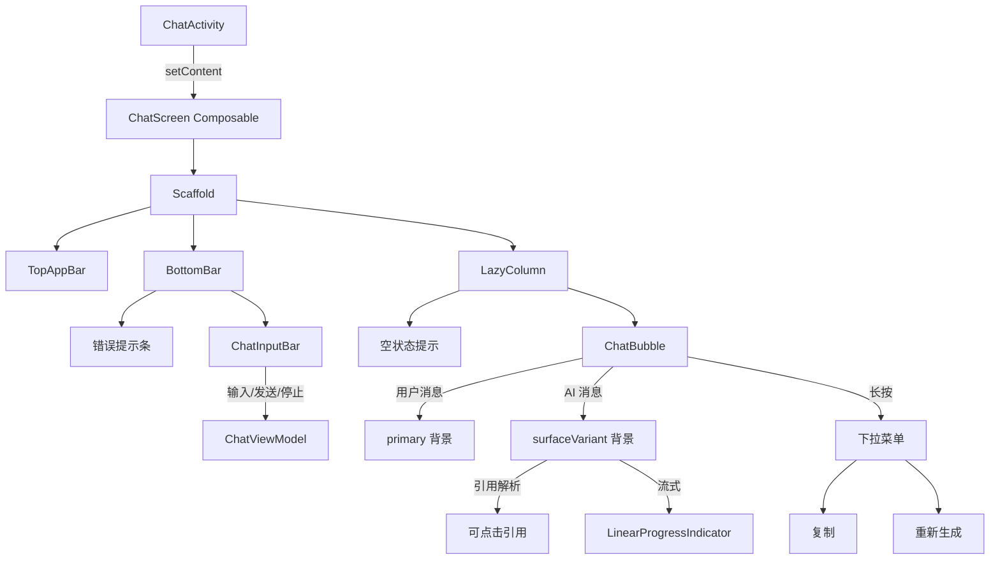
```mermaid
graph TD
    ChatActivity -->|setContent| ChatScreen[ChatScreen Composable]
    ChatScreen --> Scaffold[Scaffold]
    Scaffold --> TopBar[TopAppBar]
    Scaffold --> BottomBar[BottomBar]
    BottomBar --> ErrorBanner[错误提示条]
    BottomBar --> ChatInputBar[ChatInputBar]
    ChatInputBar -->|输入/发送/停止| ChatViewModel
    
    Scaffold --> LazyColumn[LazyColumn]
    LazyColumn --> EmptyState[空状态提示]
    LazyColumn --> Bubble[ChatBubble]
    Bubble -->|用户消息| UserBubble[primary 背景]
    Bubble -->|AI 消息| AIBubble[surfaceVariant 背景]
    AIBubble -->|引用解析| AnnotatedText[可点击引用]
    AIBubble -->|流式| ProgressBar[LinearProgressIndicator]
    Bubble -->|长按| DropdownMenu[下拉菜单]
    DropdownMenu --> Copy[复制]
    DropdownMenu --> Regenerate[重新生成]
```

- `ChatActivity` 使用 `ComponentActivity` + `setContent` Compose
- 消息列表使用 `LazyColumn` + `rememberLazyListState`，新消息自动滚动到底部
- 双气泡设计：用户消息右对齐（primary），AI 回答左对齐（surfaceVariant）
- 支持深色/浅色模式跟随系统

#### 聊天持久化

- `ChatRepositoryImpl` → `ChatMessageDao` → `ChatMessageEntity`
- `observeMessages(documentId)` 返回 `Flow<List<StoredChatMessage>>`（Room Flow 自动推送）
- 外键级联：删除文档同时删除关联聊天记录
- 本地-only 消息：未保存的流式占位符 + 未持久化的用户消息，通过 ID ≥ LOCAL_ID_OFFSET 识别

---

## 5. 关键决策记录（ADR）

每个重要的技术决策记录在此，参考 [Architecture Decision Records](https://adr.github.io/)。

### ADR-001: 用 XML 而非 Compose

- **背景**：开发者是 Android 新手，5 周硬 DDL
- **决策**：用 XML + ViewBinding + Material Components
- **理由**：XML 资料和 AI 训练数据更充足，新手 + AI 辅助路径更稳；Compose 状态管理对新手是额外认知负担
- **代价**：与 2026 主流（Compose）有距离，面试时要解释清楚选择理由
- **日期**：2026-05-11

### ADR-002: 用「PC 端 LLM 服务 + OpenAI 兼容协议」桥接，而非端侧推理

- **背景**：5 周内无法稳定集成 LiteRT-LM 端侧推理；开发机已装 LM Studio，模型现成
- **候选**：
  - A. 端侧推理（LiteRT-LM + Gemma 3n）：开发周期长、设备适配复杂
  - B. PC 端 **Ollama** + Ollama 私有协议（原计划）
  - C. PC 端 **LM Studio** + **OpenAI 兼容协议**（最终选）
  - D. 直接对接云端 OpenAI / DeepSeek API
- **决策**：开发期采用 **C**；契约层固定为 OpenAI Chat Completions 协议；端侧推理列为 v2；云端 API 因协议同构，未来可零改动切换
- **理由**：
  1. **零下载成本**：LM Studio 已装，Gemma 3 4B-IT Q4_K_M / Gemma 3n E4B-IT Q8_0 已下载
  2. **协议通用**：OpenAI Chat Completions 是事实标准，DeepSeek / 通义 / Together AI / vLLM 全兼容；Ollama 私有协议只服务 Ollama
  3. **未来扩展便宜**：从 LM Studio 切到云端 DeepSeek 只需改 `BASE_URL` 和 API Key
  4. **简历叙事更通用**：写"对接 OpenAI 兼容 LLM 服务"比"对接 Ollama"通用性更强
- **代价**：演示需要 PC 在线；LM Studio Server 需要手动在 GUI 里点 Start（或 `lms server start`，可写脚本）；不能脱机使用
- **端口**：`localhost:1234`（adb reverse `tcp:1234 tcp:1234`）
- **日期**：2026-05-11（初稿）/ 2026-05-11（修订：Ollama → LM Studio + OpenAI 兼容）

### ADR-003: 单 Module 而非多 Module

- **背景**：Clean Architecture 通常多模块化
- **决策**：单 `app` module + 严格分包
- **理由**：避免新手在多模块 Gradle 配置上浪费 1–2 天；分包 + 包路径规则也能保证依赖方向
- **代价**：编译时无法强制依赖方向（靠人工 review + 包路径规则）
- **日期**：2026-05-11

### ADR-004: 主动降级到 AGP 8.7.3 黄金组合，放弃 AGP 9.0.1

- **背景**：AS 默认生成 AGP 9.0.1 + Gradle 9.2.1 + Kotlin 2.2.20 工程；Week 0 配 Hilt + KSP 时连续撞 3 类兼容性问题：
  1. KSP 2.2.20-2.0.x 与 AGP 9 built-in Kotlin 互不兼容（KSP 明确抛错）
  2. KGP `kotlin("android")` 2.2.20 跟 AGP 9 ApplicationExtensionImpl 出现 ClassCastException
  3. Hilt 2.59 在 AGP 9 上有 ComponentTreeDeps 缺失问题（2.59.2 才修），生态稳定性不足
- **候选**：
  - A. 继续在 AGP 9 上死磕（升 Kotlin 到 2.3.x + KSP 2.3.x + Hilt 2.59.2）
  - B. 降到 AGP 8.13（2025 末），Kotlin 2.2.20 + Hilt 2.58
  - C. 降到 **AGP 8.7.3 黄金组合**：Kotlin 2.0.21 + KSP 2.0.21-1.0.28 + Hilt 2.52 + Gradle 8.10.2
- **决策**：C
- **理由**：
  1. **生态成熟**：2024 末 - 2025 中的事实主流组合，全网文档、AI 训练数据、Stack Overflow 答案密度最高
  2. **零兼容性意外**：Hilt 2.52、KSP 2.0.21、AGP 8.7 三方半年以上的实战互验
  3. **代价小**：仅放弃 API 36 预览（实际改用 API 35 = Android 15），项目层零影响
  4. **节省 Week 0 预算**：撞兼容性坑会把 Week 0 拖到 W1，影响后续节奏
- **代价**：
  - targetSdk/compileSdk 35（不是 36）
  - Gradle 8.10.2（不是 9.2.1）
  - 简历无法标"AGP 9 早鸟"——但 AGP 9 在 2026 年还不是招聘要求
- **可逆性**：v2 可升级到 AGP 9 稳定版（预计 2026 年中），仅需更新 `libs.versions.toml` 和处理 `BuildConfig`/built-in Kotlin 几个点
- **关键避坑总结**：
  - AGP 8 起 `BuildConfig` 默认禁用，需要 `buildFeatures { buildConfig = true }`
  - KSP + AGP 9 built-in Kotlin 暂不兼容，必须 `android.builtInKotlin=false` 并显式 apply `kotlin("android")`
  - `kotlin("android")` 是否 apply 取决于 AGP 版本：AGP 9 内置不要 apply，AGP 8 必须 apply
- **日期**：2026-05-11

### ADR-005: 为什么 Chat 用 Compose 但 Reader 用 XML

- **背景**：W4 开始之前开发者已积累 3 周 XML 经验，但对 Compose 有了基本认知
- **决策**：ChatActivity 使用 Jetpack Compose（W4 引入），ReaderActivity 及 LibraryActivity 仍保留 XML
- **理由**：
  1. **聊天 UI 天然适合 Compose**：LazyColumn 消息列表 + 不同气泡类型 + 引用可点击文本，Compose 的声明式范式让这些复杂度大幅降低
  2. **渐进式采用**：不在 W4 这个时间点同时重写所有页面，降低风险
  3. **简历叙事**：同时展示 XML 和 Compose 能力，证明开发者能驾驭两种范式
  4. **Reader 已有完整实现**：PdfPageView 自定义 View、PDFium 会话等通过 AndroidView 与 Compose 互操作，整体迁移收益有限
- **代价**：应用内两种 UI 范式可能给后续维护者带来认知负担；主题统一需要同时维护 XML theme 和 Compose MaterialTheme
- **缓解措施**：`PocketPDFTheme` Composable 包裹 XML Theme 的 color 定义，保证双范式使用同一色板
- **日期**：2026-05-25（W4）

### ADR-006: 为什么用 MediaPipe on-device embedding 而非云端 API

- **背景**：W2 需要将文本切片转为向量，有两个方向：端侧（MediaPipe/ONNX）或云端（OpenAI Embeddings API）
- **候选**：
  - A. 云端 OpenAI Embeddings API：简单但付费且需要网络
  - B. 端侧 MediaPipe TextEmbedder：Google 官方库，模型文件 `.tflite`
  - C. 端侧 ONNX Runtime：更灵活但需要更多配置
- **决策**：B — MediaPipe TextEmbedder
- **理由**：
  1. **完全离线**：向量化不依赖网络，用户导入 PDF 后即使断网也能索引和检索
  2. **零 API 成本**：无需 Embeddings API 费用
  3. **低延迟**：端侧推理 10ms 内完成单条 embedding
  4. **隐私**：文档内容完全不上云
- **代价**：
  - 模型精度低于大型云端 embedding 模型（如 text-embedding-3-large）
  - 需要打包 `.tflite` 模型文件到 APK（约 15MB）
  - 部分设备可能不支持 MediaPipe（但 minSdk 26 覆盖了绝大多数）
- **可逆性**：`EmbeddingEngine` 接口抽象好，未来可无缝切换为云端或 ONNX
- **日期**：2026-05-18（W2）

---

## 6. 性能预算

| 操作 | 目标 | 备注 |
|------|------|------|
| 冷启动 | < 2s | minSdk 26 中端机 |
| 100 页 PDF 文本提取 | < 5s | PdfiumAndroid，真机基准持续校准 |
| 100 页 PDF 索引（chunk + embed） | < 30s | 后台 WorkManager |
| 检索 Top-5 | < 200ms | 内存余弦相似度，全量向量已加载 |
| LLM 首 token | < 3s | LM Studio + Gemma 3 4B-IT Q4_K_M |
| 流式 token 速度 | > 15 tokens/s | PC 端 LM Studio |
| 单条 embedding | < 30ms | MediaPipe on-device |
| 摘要缓存命中 | < 5ms | DataStore 本地读取 |

---

## 7. 屏幕导航流

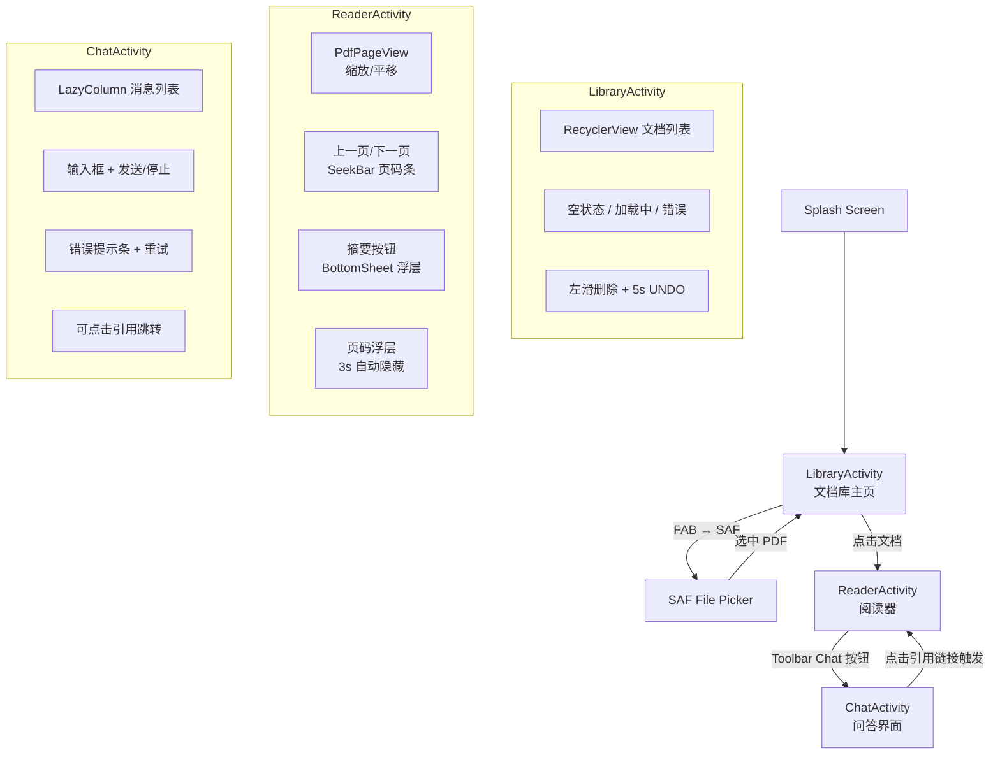
```mermaid
graph TD
    Splash[Splash Screen] --> Library[LibraryActivity<br/>文档库主页]
    Library -->|FAB → SAF| Import[SAF File Picker]
    Import -->|选中 PDF| Library
    Library -->|点击文档| Reader[ReaderActivity<br/>阅读器]
    Reader -->|Toolbar Chat 按钮| Chat[ChatActivity<br/>问答界面]
    Chat -->|点击引用链接触发| Reader
    
    subgraph LibraryActivity
        LList[RecyclerView 文档列表]
        LState[空状态 / 加载中 / 错误]
        LSwipe[左滑删除 + 5s UNDO]
    end
    
    subgraph ReaderActivity
        RPDF[PdfPageView<br/>缩放/平移]
        RNav[上一页/下一页<br/>SeekBar 页码条]
        RSummary[摘要按钮<br/>BottomSheet 浮层]
        RIndicator[页码浮层<br/>3s 自动隐藏]
    end
    
    subgraph ChatActivity
        CMessages[LazyColumn 消息列表]
        CInput[输入框 + 发送/停止]
        CError[错误提示条 + 重试]
        CCitation[可点击引用跳转]
    end
```

---

## 8. 安全与隐私

- 文档复制到 App 内部存储（`filesDir/documents/`），其他应用无法访问
- 文档不上云
- LLM 调用走 `adb reverse` 到 localhost:1234（LM Studio），**数据不出 PC**
- Embedding 完全端侧推理（MediaPipe），不依赖网络
- 不收集任何遥测数据
- API Key（可选）存储在 DataStore 中，仅用于云端 LLM 服务场景
- Room 数据库自动加密不在 v1 范围（文档本身已存明文，底层文件系统加密由 Android 全盘加密保证）

---

## 附录：依赖图完整版

```mermaid
graph TD
    subgraph "Domain Layer (纯 Kotlin)"
        UC[UseCase]
        MOD[Model<br/>Document/DocumentChunk/<br/>ChatMessage/IndexStatus]
        REPO[Repository Interface<br/>DocumentRepository/LlmRepository/<br/>ChatRepository]
        PROMPT[PromptTemplates]
        CHUNKER[TextChunker Interface]
        EMBED[EmbeddingEngine Interface]
    end
    
    subgraph "Data Layer"
        IMPL[Repository Impl]
        ROOM[Room<br/>DAO/Entity/Converter]
        PDF[PdfiumDocumentEngine<br/>PdfiumTextExtractor]
        MP[MediaPipeEmbeddingEngine]
        CHUNK[SlidingWindowChunker<br/>ParagraphChunker]
        NW[OkHttp<br/>LlmRepositoryImpl/SseStreamParser]
        WK[WorkManager<br/>IndexWorker/IndexingScheduler]
        DS[DataStore<br/>SettingsDataStore/SwiftCacheStore]
        STORE[InternalFileStorage]
    end
    
    subgraph "UI Layer"
        XML[XML View<br/>LibraryActivity/ReaderActivity]
        COMPOSE[Compose<br/>ChatActivity]
        VM[ViewModel<br/>LibraryViewModel/ReaderViewModel/<br/>ChatViewModel/SettingsViewModel]
        THEME[Theme<br/>Material 3 Purple]
    end
    
    subgraph "DI Layer"
        HILT[Hilt Modules<br/>@Binds @Provides]
    end
    
    subgraph "Core Layer"
        RESULT[Result sealed class]
        DISP[DispatcherProvider]
        CIT[CitationParser]
    end
    
    XML --> VM
    COMPOSE --> VM
    VM --> UC
    UC --> REPO
    UC --> PROMPT
    UC --> CHUNKER
    UC --> EMBED
    HILT -.-> IMPL
    HILT -.-> ROOM
    IMPL --> ROOM
    IMPL --> NW
    IMPL --> PDF
    IMPL --> STORE
    IMPL --> DS
    WK --> PDF
    WK --> CHUNK
    WK --> MP
    WK --> IMPL
```
